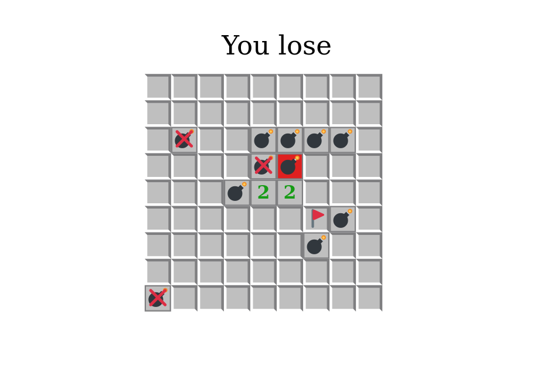

# Stego-Minesweeper


This is an implementation of a minesweeper game-based steganography scheme, 
where some secret message is hidden inside the playable minesweeper game.

# Usage
## Building
This project can be build with Stack tool and GHC 8.8.4.

To build and run a project (without tests), use

```sh
stack run
```

from the project directory. This will download all the necessary dependencies, compile the project and start CodeWorld canvas server at [http://localhost:3000](http://localhost:3000)

To simply build the project, run

```sh
stack build
```

To run tests:

```sh
stack test
```

## Playing
To play the game with encoded message inside, run the project with the following command
```sh
stack run -- --input 'put your message here'
```

Click on cells to open them. Hold `Ctrl` to mark them.

**How to win**: you should open all cells except ones with bombs.

**How to lose**: click on a cell with a bomb.

**How to play again**: press `Esc`.

## Decoding the message
To retrieve the message from game, collect the bits on board (0 is an empty cell, 1 is a bomb) in the anticlockwise order 
(left->down->right->up) starting from the first move position. Refer to the mentioned paper for more details. 

To decode the retrieved from game message, run the project with the following command
```sh
stack run -- --input 'put your binary string here' --decode
```

# Description
## Project scope
This project is based on [1], where researchers describe the usage of the “Minesweeper” game as the steganography tool. 
Our team will focus on the game itself and on the proposed way of encoding messages as the grid of mines.

## Minimal requirements (Stage 1)
1. Playable “Minesweeper” game with some hard-coded message and preferences (number of mines and board size):
   1. player can win or lose;
   2. player can do only valid moves;
   3. all game mechanics work correctly (e.g. number of neighbor mines).

## Additional features (Stage 2)
1. Converting any message (ASCII string) to the grid of mines for the game.
2. Menu (configurable preferences).
3. Client-server architecture (i.e. one user can create a game with a hidden message and share it with another user).
4. Separate utility for decoding the secret message from the game grid.

## References
[1] S. Mahato, D. Yadav and D. Khan, "A minesweeper game-based steganography scheme", 
Journal of Information Security and Applications, vol. 32, pp. 1-14, 2017 
[Online]. Available: https://www.sciencedirect.com/science/article/pii/S2214212616303064. 
[Accessed: 05 Jun. 2022]
